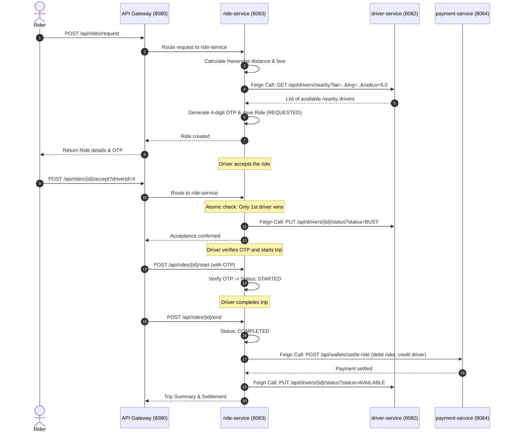

# RidePulse (Uber Backend) — Microservices Architecture & Implementation Plan

Welcome to the **RidePulse** microservices backend! This document outlines the modern **Distributed Microservices Architecture**, inter-service communication flow, database-per-service pattern, and phase-by-phase implementation plan in **Java & Spring Boot**.

---

## 1. Microservices System Architecture

Instead of a single monolithic application, the project is divided into independent, decoupled microservices managed under a **Multi-Module Maven Project**:

```
                       [ Client / Postman ]
                                │
                                ▼
         ┌──────────────────────────────────────────────┐
         │     API Gateway (Spring Cloud Gateway)       │
         │                 Port: 8080                   │
         └───────┬──────────────┬──────────────┬────────┘
                 │              │              │
      Routes:    │              │              │
    /api/auth/** │ /api/drivers/** /api/rides/** /api/wallets/**
                 ▼              ▼              ▼
     ┌──────────────┐   ┌──────────────┐   ┌──────────────┐   ┌──────────────┐
     │ user-service │   │driver-service│   │ ride-service │   │payment-serv. │
     │  Port: 8081  │   │  Port: 8082  │   │  Port: 8083  │   │  Port: 8084  │
     └──────┬───────┘   └──────┬───────┘   └──────┬───────┘   └──────┬───────┘
            │                  │                  │                  │
            ▼                  ▼                  ▼                  ▼
     [ userdb (H2) ]    [driverdb (H2)]    [ ridedb (H2) ]    [paymentdb(H2)]
            ▲                  ▲                  ▲                  ▲
            └──────────────────┴────────┬─────────┴──────────────────┘
                                        │
                         Registers With & Discovers Via
                                        │
                                        ▼
                      ┌────────────────────────────────────┐
                      │  Service Registry (Eureka Server)  │
                      │            Port: 8761              │
                      └────────────────────────────────────┘
```

---

## 2. Microservices Breakdown

| Service | Port | Database | Responsibilities |
|---------|------|----------|-------------------|
| **`service-registry`** | `8761` | None | **Netflix Eureka Server**: Central directory where every microservice registers so they can find each other dynamically without hardcoded URLs. |
| **`api-gateway`** | `8080` | None | **Spring Cloud Gateway**: Single entry point for all frontend/client requests. Dynamically routes traffic to backend microservices using Eureka service names (`lb://user-service`, etc.). |
| **`user-service`** | `8081` | `userdb` | Handles User registration (Rider / Driver), Login, Role assignments (`ROLE_RIDER`, `ROLE_DRIVER`), and customer profile management. |
| **`driver-service`** | `8082` | `driverdb` | Stores vehicle details, availability status (`AVAILABLE`, `BUSY`, `OFFLINE`), live GPS coordinates, and spatial queries to find nearby drivers. |
| **`ride-service`** | `8083` | `ridedb` | **The Core Brain / Orchestrator**: Calculates distance and fare, generates 4-digit OTP, manages atomic acceptance to prevent race conditions, and coordinates ride state transitions. |
| **`payment-service`** | `8084` | `paymentdb` | Digital wallet balance, top-up API, automatic fare deduction from rider, driver earnings payout (80% driver, 20% platform commission), and transaction ledger. |

---

## 3. Inter-Service Communication Flow (OpenFeign)

We use **Spring Cloud OpenFeign**, which provides clean, declarative, type-safe HTTP clients between microservices:



---

## 4. Multi-Module Project Structure

```
uber-backend/
├── pom.xml                     <-- Parent POM (declares modules, Spring Boot & Cloud versions)
├── IMPLEMENTATION_PLAN.md      <-- This Architecture & Roadmap Guide
├── service-registry/           <-- Eureka Server (Port 8761)
│   ├── pom.xml
│   └── src/main/java/com/krishu/uber/registry/ServiceRegistryApplication.java
├── api-gateway/                <-- Spring Cloud Gateway (Port 8080)
│   ├── pom.xml
│   └── src/main/java/com/krishu/uber/gateway/ApiGatewayApplication.java
├── user-service/               <-- Auth & User Accounts (Port 8081)
│   ├── pom.xml
│   └── src/main/java/com/krishu/uber/user/...
├── driver-service/             <-- Drivers, GPS Location & Nearby Search (Port 8082)
│   ├── pom.xml
│   └── src/main/java/com/krishu/uber/driver/...
├── ride-service/               <-- Booking Engine, OTP, State Transitions (Port 8083)
│   ├── pom.xml
│   └── src/main/java/com/krishu/uber/ride/...
└── payment-service/            <-- Digital Wallet & Ride Settlement (Port 8084)
    ├── pom.xml
    └── src/main/java/com/krishu/uber/payment/...
```

---

## 5. Phase-by-Phase Implementation Roadmap

### **Phase 1: Parent Multi-Module Setup & Service Registry (Eureka Server)**
* **Goal**: Establish the multi-module Maven structure and launch the Service Registry.
* **Tasks**:
  1. Configure root `pom.xml` with `<packaging>pom</packaging>` and `dependencyManagement` for Spring Boot 3.3.4 and Spring Cloud 2023.0.3.
  2. Create the `service-registry` module with `spring-cloud-starter-netflix-eureka-server`.
  3. Create `ServiceRegistryApplication.java` with `@EnableEurekaServer`.
  4. Configure `application.properties` on port `8761`.
* **Verification**:
  - Run the Service Registry and open `http://localhost:8761` in the browser to view the live Eureka Dashboard.

---

### **Phase 2: API Gateway (Spring Cloud Gateway)**
* **Goal**: Create the central entry point that routes client requests to backend services.
* **Tasks**:
  1. Create `api-gateway` module with `spring-cloud-starter-gateway` and `spring-cloud-starter-netflix-eureka-client`.
  2. Configure route definitions in `application.yml` / `application.properties`:
     - Path `/api/auth/**` $\rightarrow$ `lb://user-service`
     - Path `/api/drivers/**` $\rightarrow$ `lb://driver-service`
     - Path `/api/rides/**` $\rightarrow$ `lb://ride-service`
     - Path `/api/wallets/**` $\rightarrow$ `lb://payment-service`
* **Verification**:
  - Start API Gateway on port `8080` and verify it registers with Eureka at `http://localhost:8761`.

---

### **Phase 3: User & Auth Service (`user-service`)**
* **Goal**: Enable user registration, login, and profile lookups.
* **Tasks**:
  1. Create `user-service` module (Port `8081`) with Spring Data JPA, Web, Validation, and Eureka Client.
  2. Create entities: `User` (`id`, `name`, `email`, `password`, `phone`, `role`), `Rider`.
  3. Implement `AuthService` with endpoints:
     - `POST /api/auth/register-rider`
     - `POST /api/auth/register-driver`
     - `POST /api/auth/login`
     - `GET /api/auth/users/{id}`
  4. Integrate Feign client to notify `payment-service` to create an initial digital wallet with a ₹100 welcome bonus upon signup.
* **Verification**:
  - Test registration and login by hitting `http://localhost:8080/api/auth/...` through the API Gateway.

---

### **Phase 4: Driver & Location Service (`driver-service`)**
* **Goal**: Manage driver availability, live GPS updates, and nearby driver discovery.
* **Tasks**:
  1. Create `driver-service` module (Port `8082`) with Spring Data JPA, Web, and Eureka Client.
  2. Create `Driver` entity (`vehicleNumber`, `vehicleModel`, `status`, `currentLatitude`, `currentLongitude`, `rating`).
  3. Implement `LocationUtil` using the **Haversine formula** to calculate distance between GPS coordinates.
  4. Endpoints:
     - `POST /api/drivers/register-profile`
     - `PUT /api/drivers/{id}/location` (update live GPS coordinates)
     - `PUT /api/drivers/{id}/status` (set `AVAILABLE`, `BUSY`, `OFFLINE`)
     - `GET /api/drivers/nearby?lat=...&lng=...&radiusKm=5.0` (find available drivers nearby)
* **Verification**:
  - Set driver GPS location and query nearby drivers through `http://localhost:8080/api/drivers/nearby`.

---

### **Phase 5: Ride & Booking Service (`ride-service`)**
* **Goal**: Orchestrate ride bookings, pricing, 4-digit OTP, atomic driver acceptance, and trip lifecycle.
* **Tasks**:
  1. Create `ride-service` module (Port `8083`) with Spring Data JPA, Web, OpenFeign, and Eureka Client.
  2. Create `Ride` entity (`pickupAddress`, `dropoffAddress`, coordinates, `distanceInKm`, `fare`, `otp`, `status`, `paymentMethod`, timestamps).
  3. Implement `FareCalculator`: `Base Fare + (Distance * Rate) * Surge`.
  4. Create Feign client `DriverClient` to call `driver-service`.
  5. Implement atomic concurrency control for driver acceptance (`synchronized` / DB row status check).
  6. Endpoints:
     - `POST /api/rides/request` (book cab, compute fare, generate 4-digit OTP, return details)
     - `POST /api/rides/{id}/accept?driverId=X` (atomic acceptance)
     - `POST /api/rides/{id}/arrive?driverId=X` (driver marks arrival)
     - `POST /api/rides/{id}/start?driverId=X` (verify OTP and start trip)
     - `POST /api/rides/{id}/end?driverId=X` (finish trip, trigger payment)
     - `GET /api/rides/{id}`
* **Verification**:
  - Step through a complete trip lifecycle from booking to completion.

---

### **Phase 6: Payment & Wallet Service (`payment-service`) & End-to-End Verification**
* **Goal**: Manage digital balances, deduct fare on trip completion, credit driver earnings, and verify the entire system.
* **Tasks**:
  1. Create `payment-service` module (Port `8084`).
  2. Create entities: `Wallet` (`userId`, `balance`) and `WalletTransaction` (`amount`, `type`, `description`, `timestamp`).
  3. Endpoints:
     - `POST /api/wallets/create?userId=X` (creates wallet with ₹100 welcome bonus)
     - `GET /api/wallets/{userId}` (view balance and transaction history)
     - `POST /api/wallets/add-money` (wallet top-up)
     - `POST /api/wallets/settle-ride` (called by `ride-service`: deducts fare from rider, credits 80% to driver, records transactions)
  4. Build an end-to-end automated cURL test script demonstrating the complete flow through `http://localhost:8080`.
* **Verification**:
  - Run the test script and verify wallet balance changes and trip completion.

---

## 6. Key Java & Microservices Concepts Learned for Interviews

1. **Service Discovery (Eureka)**: Why dynamic registration is better than hardcoding IP addresses in microservices.
2. **API Gateway Pattern**: Centralized routing, single entry point, and shielding internal service topologies.
3. **Declarative REST Clients (Spring Cloud OpenFeign)**: How microservices communicate synchronously with clean Java interfaces.
4. **Database-per-Service**: Why each microservice has its own isolated database schema to prevent tight coupling.
5. **Distributed Concurrency & Race Conditions**: How atomic checks prevent two drivers from accepting the same ride request.
6. **Geospatial Calculations**: Using the Haversine formula to compute great-circle distances between GPS coordinates.
